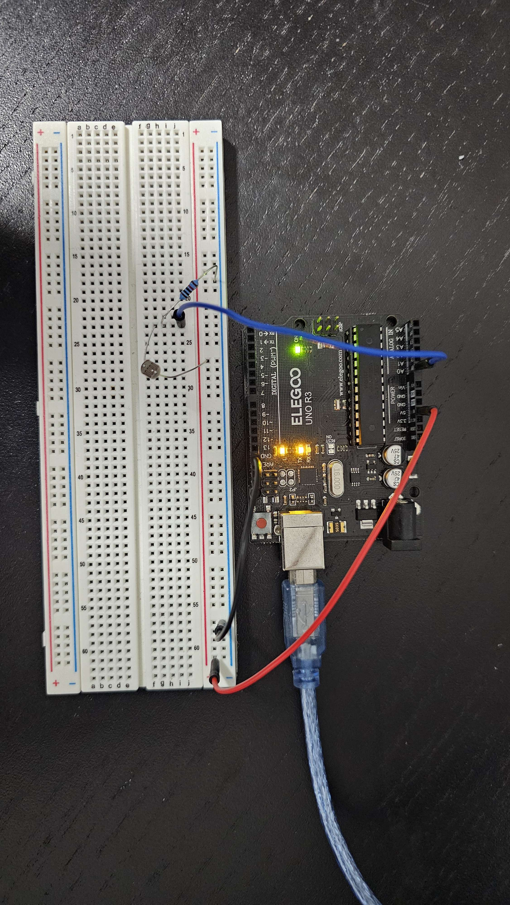

# Light Oscilloscope with Arduino

This is a basic digital oscilloscope built using Arduino and a photoresistor(LDR). It detects changes in light intensity and displays the waveform in real-time using the Arduino IDE's Serial Plotter.

## Features

-Real-time waveform of light levels
-Uses simple components (LDR + resistor)
-Adjustable time/div via code
-Easily extendable for sound or sensors

## Circuit Diagram

**Components**
- 1x Arduino Uno 
- 1x Photoresistor (LDR)
- 1x 10k ohm resistor
- Breadboard + jumper wires

## Voltage Divider Circuit (for LDR input)

To safely and accurately read light levels using a photoresistor (LDR), we use a **voltage divider circuit**. This converts changes in light into a variable voltage that the Arduino can read through its analog pin.

### How it Works

A voltage divider splits the input voltage (5V) across two resistors. In our case:
-**R1** = LDR (Whose resistance changes with light)
-**R2** = Fixed resistor (typically 10k ohm)

The voltage at the midpoint (between R1 and R2) is connected to **Arduino A0** (Blue wire). This voltage changes ba 